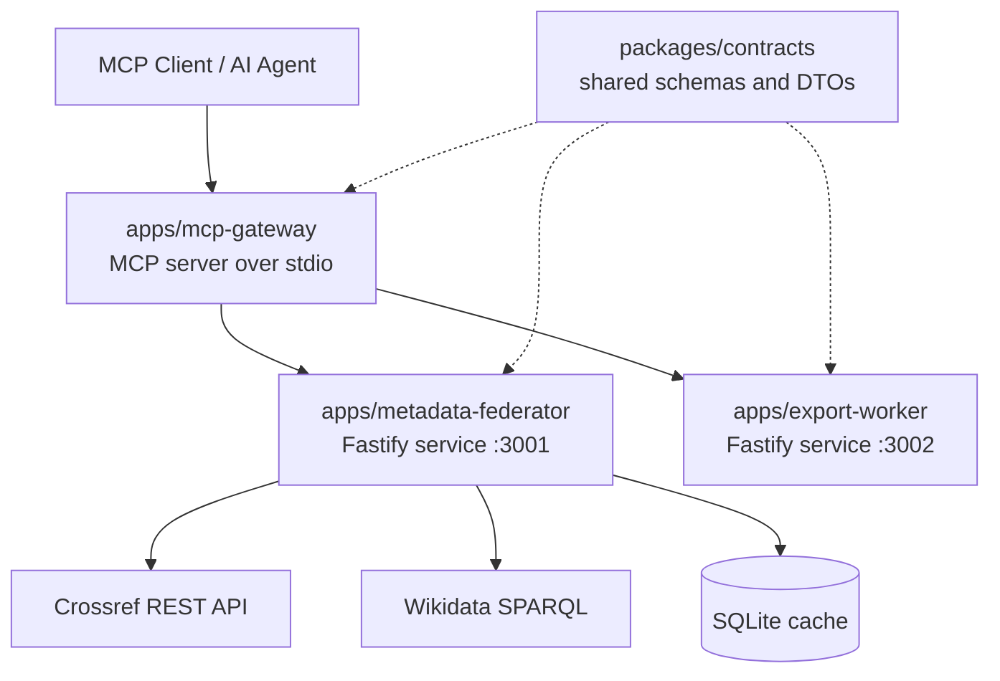

# Citemesh MCP

Federated scholarly metadata tools for MCP clients.

CItemesh is a small monorepo that lets an AI agent:

- search scholarly works from Crossref
- resolve DOI metadata into one normalized shape
- enrich works with Wikidata entities
- batch-resolve multiple DOIs
- export results as CSV or JSON
- generate citation outputs such as BibTeX, CSL-JSON, and formatted bibliography text

The project is split into focused services:

- `apps/metadata-federator` fetches and normalizes metadata
- `apps/export-worker` formats and exports results
- `apps/mcp-gateway` exposes the functionality as MCP tools over stdio
- `packages/contracts` shares schemas and DTOs across the services


## What Problem It Solves

Research metadata from public APIs is messy. Crossref records vary in title shape, dates, abstracts, and author fields. CItemesh solves that by normalizing everything into one predictable `WorkRecord` schema before the data reaches the AI agent or export layer.

That means an MCP client does not need to know:

- how Crossref structures its payloads
- how to clean DOI inputs
- how to strip JATS tags from abstracts
- how to combine metadata lookup and export formatting

## Architecture



## Monorepo Structure

```text
citemesh-mcp/
|-- apps/
|   |-- export-worker/
|   |   |-- src/
|   |   |   |-- __tests__/
|   |   |   |-- routes/
|   |   |   `-- services/
|   |-- mcp-gateway/
|   |   `-- src/
|   |       |-- index.ts
|   |       |-- service-client.ts
|   |       `-- tools.ts
|   `-- metadata-federator/
|       |-- src/
|       |   |-- __tests__/
|       |   |-- cache/
|       |   |-- routes/
|       |   `-- services/
|       `-- vitest.config.ts
|-- packages/
|   `-- contracts/
|       `-- src/
|           |-- dtos.ts
|           |-- errors.ts
|           `-- work.ts
|-- .env.example
|-- package.json
|-- pnpm-workspace.yaml
`-- tsconfig.base.json
```

## Services and Responsibilities

| Package | Role | Default port |
|---|---|---|
| `@citemesh/metadata-federator` | Search, DOI resolution, batching, Wikidata enrichment, SQLite response cache | `3001` |
| `@citemesh/export-worker` | CSV export, JSON export, BibTeX, CSL-JSON, formatted bibliography | `3002` |
| `@citemesh/mcp-gateway` | MCP tool registration, input validation, delegation to internal services | stdio |
| `@citemesh/contracts` | Shared Zod schemas, DTOs, error shapes, normalized types | n/a |

## Main MCP Tools

The gateway exposes these tools:

| Tool | What it does |
|---|---|
| `search_works` | Search Crossref by query or author |
| `resolve_doi` | Resolve one DOI into a normalized record |
| `batch_lookup_dois` | Resolve up to 50 DOIs in one call |
| `enrich_work_entities` | Resolve a work and attach Wikidata entity info |
| `build_bibliography` | Produce BibTeX, CSL-JSON, or formatted bibliography |
| `export_results` | Export normalized works as CSV or JSON |

## Normalized Data Model

Every service works around a shared `WorkRecord` shape:

```ts
type WorkRecord = {
  doi: string;
  title: string;
  authors: Array<{
    given?: string;
    family?: string;
    name?: string;
    orcid?: string;
    affiliation?: string[];
  }>;
  year: number | null;
  source: string;
  type: string;
  publisher?: string;
  url?: string;
  abstract?: string;
  external_ids: {
    doi?: string;
    pmid?: string;
    arxiv?: string;
    wikidata?: string;
    isbn?: string[];
    issn?: string[];
  };
  raw_source: "crossref" | "wikidata" | "manual";
};
```

## Tech Stack

- Node.js
- TypeScript
- pnpm workspaces
- Fastify
- Zod
- MCP TypeScript SDK
- SQLite via `better-sqlite3`
- Crossref REST API
- Wikidata SPARQL
- Citation.js
- Vitest

## Prerequisites

- Node.js `20+`
- pnpm `8+`
- Internet access for live Crossref and Wikidata calls
- On Windows, Python and Visual Studio Build Tools may be needed if `better-sqlite3` compiles locally

## Setup

```bash
pnpm install
pnpm build
```

Copy the environment file:

```bash
cp .env.example .env
```

At minimum, update:

- `CROSSREF_MAILTO` with your email

The default `.env.example` already includes:

- `METADATA_FEDERATOR_PORT=3001`
- `EXPORT_WORKER_PORT=3002`
- `METADATA_FEDERATOR_URL=http://localhost:3001`
- `EXPORT_WORKER_URL=http://localhost:3002`
- `CACHE_DB_PATH=./cache.db`
- `CACHE_TTL_SECONDS=3600`

## Run the Project

Run everything in parallel from the repo root:

```bash
pnpm dev
```

Or run each service separately:

```bash
pnpm --filter @citemesh/metadata-federator dev
pnpm --filter @citemesh/export-worker dev
pnpm --filter @citemesh/mcp-gateway dev
```

## Build and Test

Build the whole monorepo:

```bash
pnpm build
```

Run all tests:

```bash
pnpm test
```

What is covered today:

- metadata normalization tests
- DOI utility tests
- batch response shape tests
- live integration tests for `metadata-federator`
- CSV export tests
- bibliography generation tests

## Quick Manual Smoke Test

### 1. Start the HTTP services

```bash
pnpm --filter @citemesh/metadata-federator dev
pnpm --filter @citemesh/export-worker dev
```

### 2. Check health routes

```bash
curl http://127.0.0.1:3001/health
curl http://127.0.0.1:3002/health
```

Expected:

```json
{"status":"ok","service":"metadata-federator"}
{"status":"ok","service":"export-worker"}
```

### 3. Search works

```bash
curl -X POST http://127.0.0.1:3001/search \
  -H "Content-Type: application/json" \
  -d "{\"query\":\"attention is all you need\",\"rows\":1}"
```

### 4. Resolve a DOI

```bash
curl -X POST http://127.0.0.1:3001/resolve \
  -H "Content-Type: application/json" \
  -d "{\"doi\":\"10.1038/s41586-021-03819-2\"}"
```

### 5. Export a work as CSV

```bash
curl -X POST http://127.0.0.1:3002/export \
  -H "Content-Type: application/json" \
  -d "{\"works\":[{\"doi\":\"10.1038/s41586-021-03819-2\",\"title\":\"Highly accurate protein structure prediction with AlphaFold\",\"authors\":[{\"family\":\"Jumper\",\"given\":\"John\"}],\"year\":2021,\"source\":\"Nature\",\"type\":\"journal-article\",\"publisher\":\"Springer Nature\",\"url\":\"https://doi.org/10.1038/s41586-021-03819-2\",\"abstract\":\"Proteins are essential to life.\",\"external_ids\":{\"doi\":\"10.1038/s41586-021-03819-2\",\"issn\":[\"0028-0836\"]},\"raw_source\":\"crossref\"}],\"format\":\"csv\"}"
```

### 6. Generate BibTeX

```bash
curl -X POST http://127.0.0.1:3002/bibliography \
  -H "Content-Type: application/json" \
  -d "{\"works\":[{\"doi\":\"10.1038/s41586-021-03819-2\",\"title\":\"Highly accurate protein structure prediction with AlphaFold\",\"authors\":[{\"family\":\"Jumper\",\"given\":\"John\"}],\"year\":2021,\"source\":\"Nature\",\"type\":\"journal-article\",\"publisher\":\"Springer Nature\",\"url\":\"https://doi.org/10.1038/s41586-021-03819-2\",\"abstract\":\"Proteins are essential to life.\",\"external_ids\":{\"doi\":\"10.1038/s41586-021-03819-2\",\"issn\":[\"0028-0836\"]},\"raw_source\":\"crossref\"}],\"format\":\"bibtex\"}"
```

## Testing Through MCP

The most useful end-to-end demo is to run the two HTTP services and then attach the gateway through an MCP client or MCP Inspector.

Build first:

```bash
pnpm build
```

Run the backing services:

```bash
pnpm --filter @citemesh/metadata-federator dev
pnpm --filter @citemesh/export-worker dev
```

Then start the gateway:

```bash
node apps/mcp-gateway/dist/index.js
```

Because the gateway uses stdio, it is meant to be launched by an MCP client rather than opened in a browser directly.

### MCP Inspector

```bash
npx @modelcontextprotocol/inspector node apps/mcp-gateway/dist/index.js
```

From there you can call:

- `search_works`
- `resolve_doi`
- `build_bibliography`
- `export_results`

## Example MCP Inputs

Search:

```json
{
  "query": "transformer attention mechanism",
  "rows": 3,
  "offset": 0
}
```

Resolve DOI:

```json
{
  "doi": "10.1038/s41586-021-03819-2"
}
```

Batch lookup:

```json
{
  "dois": [
    "10.1038/s41586-021-03819-2",
    "10.1145/3290605.3300400"
  ]
}
```

Bibliography:

```json
{
  "dois": ["10.1038/s41586-021-03819-2"],
  "format": "bibtex"
}
```

CSV export:

```json
{
  "works": [
    {
      "doi": "10.1038/s41586-021-03819-2",
      "title": "Highly accurate protein structure prediction with AlphaFold",
      "authors": [{ "family": "Jumper", "given": "John" }],
      "year": 2021,
      "source": "Nature",
      "type": "journal-article",
      "publisher": "Springer Nature",
      "url": "https://doi.org/10.1038/s41586-021-03819-2",
      "external_ids": { "doi": "10.1038/s41586-021-03819-2" },
      "raw_source": "crossref"
    }
  ],
  "format": "csv"
}
```

## How To Describe This Project In Your Recording

If you want a clean, confident explanation, this is the simplest framing:

> CItemesh MCP is a scholarly metadata MCP server. It lets an AI agent search research papers, resolve DOI metadata, enrich records with Wikidata, and export normalized outputs like CSV or BibTeX. The project is split into a thin MCP gateway, a metadata federator, an export worker, and shared contracts, which keeps each responsibility isolated and easy to test.

## Suggested 2-3 Minute Video Script

### Opening

Say:

> This project is called CItemesh MCP. It is a federated scholarly metadata server built for the Model Context Protocol. The main goal is to give AI agents a clean way to search papers, resolve DOI metadata, enrich records, and export citation-ready outputs.

### Folder walkthrough

Say:

> The codebase is organized as a PNPM monorepo. The `mcp-gateway` app exposes the MCP tools. The `metadata-federator` app talks to Crossref and Wikidata and normalizes the results. The `export-worker` app converts normalized records into CSV, JSON, BibTeX, or bibliography text. The `contracts` package keeps the shared schemas and DTOs in one place so all services stay aligned.

### Architecture value

Say:

> The reason this architecture is useful is that the gateway stays thin. It only validates tool inputs and forwards work to the internal services. That makes the metadata logic and export logic testable on their own, and it also makes the system easier to extend with new sources or new export formats later.

### Demo flow

Say:

> For the demo, I start the metadata federator and export worker, then I either test the HTTP routes directly or attach the MCP gateway with MCP Inspector. A typical flow is searching for a paper, resolving a DOI into a normalized `WorkRecord`, and then exporting that record as BibTeX or CSV.

### Closing

Say:

> The key takeaway is that CItemesh acts as a clean metadata layer between research APIs and AI agents. Instead of every agent dealing with messy external payloads, they all get one stable schema and a small set of focused tools.

## Short 30-Second Version

If you need a very short explanation:

> CItemesh MCP is an MCP server for scholarly metadata. It lets AI agents search Crossref, resolve DOIs, enrich results with Wikidata, and export citation-ready formats like CSV and BibTeX through a clean multi-service architecture.

## Verified On This Repo

The following were verified locally:

- `pnpm build` passes
- `pnpm test` passes
- `metadata-federator` health, search, and DOI resolution routes run successfully
- `export-worker` health, CSV export, and BibTeX generation routes run successfully

## Troubleshooting

### `better-sqlite3` fails to load on Windows

If dependencies were installed from another OS or architecture, do a clean reinstall:

```bash
pnpm install --force
```

If Node cannot use a prebuilt binary, `better-sqlite3` may compile locally, which can require:

- Python
- Visual Studio Build Tools on Windows

### Crossref requests fail or rate-limit

Set a real email in:

```bash
CROSSREF_MAILTO=you@example.com
```

### MCP gateway appears idle

That is normal. The gateway uses stdio and waits for an MCP client such as MCP Inspector or a desktop client to connect.

## Future Improvements

- add gateway-specific unit tests
- support more scholarly sources such as OpenAlex or Semantic Scholar
- add author-level Wikidata enrichment
- add Docker-based local startup
- add API docs for the internal HTTP services
