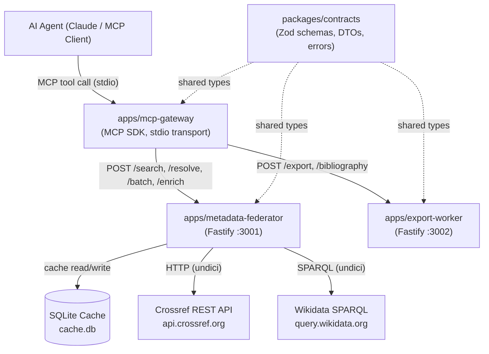

# CItemesh MCP

**Federated scholarly metadata MCP server** — lets AI agents search works, resolve DOIs, enrich metadata, batch-fetch records, and export citation-ready outputs.

Built with the [Model Context Protocol](https://modelcontextprotocol.io/) TypeScript SDK. Data comes from the [Crossref REST API](https://api.crossref.org/) and [Wikidata](https://query.wikidata.org/).

---

## Why this exists

Research agents need a reliable, normalized view of scholarly metadata. Raw Crossref responses are inconsistent — missing years, JATS-encoded abstracts, multiple title variants. CItemesh handles all of that so the agent never has to.

The multi-service architecture keeps each responsibility isolated: normalization, enrichment, and export are separate Fastify microservices. The MCP gateway is intentionally thin — it receives tool calls, validates input with Zod, and delegates. Adding a new data source (OpenAlex, Semantic Scholar) means adding one new service, not changing the gateway.

---

## Architecture



### Service responsibilities

| Service | Port | Responsibility |
|---|---|---|
| `mcp-gateway` | stdio | Receives MCP tool calls; validates input; delegates to services |
| `metadata-federator` | 3001 | Queries Crossref + Wikidata; normalizes into `WorkRecord`; SQLite cache |
| `export-worker` | 3002 | CSV, JSON, BibTeX, CSL-JSON, and APA bibliography formatting |
| `contracts` | — | Shared Zod schemas, DTOs, error types (zero runtime deps beyond Zod) |

---

## Folder structure

```
citemesh-mcp/
├── apps/
│   ├── mcp-gateway/
│   │   └── src/
│   │       ├── index.ts          # MCP server (stdio), tool dispatch
│   │       ├── tools.ts          # Tool definitions + handlers
│   │       └── service-client.ts # HTTP client for internal services
│   ├── metadata-federator/
│   │   └── src/
│   │       ├── index.ts
│   │       ├── cache/
│   │       │   └── response-cache.ts   # SQLite TTL cache
│   │       ├── services/
│   │       │   ├── crossref-client.ts  # Crossref API + normalization
│   │       │   ├── wikidata-client.ts  # Wikidata SPARQL enrichment
│   │       │   └── doi-utils.ts        # DOI parsing/validation
│   │       └── routes/
│   │           ├── search.ts, resolve.ts, batch.ts, enrich.ts
│   └── export-worker/
│       └── src/
│           ├── index.ts
│           ├── services/
│           │   ├── csv-exporter.ts     # RFC 4180 CSV
│           │   └── bibliography.ts     # Citation.js wrapper
│           └── routes/
│               ├── export.ts, bibliography.ts
└── packages/
    └── contracts/
        └── src/
            ├── work.ts    # WorkRecord, Author, WikidataEntity schemas
            ├── errors.ts  # CitemeshError, ErrorType, makeError
            └── dtos.ts    # Request/response DTOs for all routes
```

---

## Setup

### Prerequisites

- Node.js 20+
- pnpm 8+ (`npm install -g pnpm`)
- Python 3 (for building `better-sqlite3` native addon)

### Install

```bash
git clone https://github.com/your-org/citemesh-mcp
cd citemesh-mcp

# Install all workspace dependencies
pnpm install

# Build all packages
pnpm build
```

### Configure

```bash
cp .env.example .env
# Edit .env — at minimum set CROSSREF_MAILTO to your email
# for Crossref's polite pool (higher rate limits)
```

### Run services

Open **three terminals**:

```bash
# Terminal 1: metadata-federator
cd apps/metadata-federator
pnpm dev

# Terminal 2: export-worker
cd apps/export-worker
pnpm dev

# Terminal 3: mcp-gateway (connects via stdio)
cd apps/mcp-gateway
pnpm dev
```

Or run all in parallel:

```bash
pnpm dev  # from root — starts all 3 with pnpm --parallel
```

---

## MCP Tools

### 1. `search_works`

Search Crossref by keyword or author.

```json
{
  "tool": "search_works",
  "input": {
    "query": "transformer attention mechanism",
    "rows": 3,
    "offset": 0
  }
}
```

**Sample response:**

```json
{
  "items": [
    {
      "doi": "10.48550/arxiv.1706.03762",
      "title": "Attention Is All You Need",
      "authors": [
        { "given": "Ashish", "family": "Vaswani" },
        { "given": "Noam", "family": "Shazeer" }
      ],
      "year": 2017,
      "source": "arXiv",
      "type": "posted-content",
      "publisher": "arXiv",
      "url": "https://doi.org/10.48550/arxiv.1706.03762",
      "external_ids": { "doi": "10.48550/arxiv.1706.03762" },
      "raw_source": "crossref"
    }
  ],
  "pagination": {
    "total_results": 3847,
    "rows": 3,
    "offset": 0
  },
  "warnings": []
}
```

---

### 2. `resolve_doi`

Fetch full metadata for a single DOI.

```json
{
  "tool": "resolve_doi",
  "input": {
    "doi": "10.1038/s41586-021-03819-2"
  }
}
```

**Sample response:**

```json
{
  "doi": "10.1038/s41586-021-03819-2",
  "title": "Highly accurate protein structure prediction with AlphaFold",
  "authors": [
    {
      "given": "John",
      "family": "Jumper",
      "orcid": "0000-0001-6169-6580",
      "affiliation": ["DeepMind"]
    }
  ],
  "year": 2021,
  "source": "Nature",
  "type": "journal-article",
  "publisher": "Springer Nature",
  "url": "https://doi.org/10.1038/s41586-021-03819-2",
  "abstract": "Proteins are essential to life, and understanding their structure...",
  "external_ids": {
    "doi": "10.1038/s41586-021-03819-2",
    "issn": ["0028-0836", "1476-4687"]
  },
  "raw_source": "crossref"
}
```

---

### 3. `batch_lookup_dois`

Resolve up to 50 DOIs at once. Partial failures are tracked per-item.

```json
{
  "tool": "batch_lookup_dois",
  "input": {
    "dois": [
      "10.1038/s41586-021-03819-2",
      "10.1145/3290605.3300400",
      "10.1000/does-not-exist"
    ]
  }
}
```

**Sample response:**

```json
{
  "items": [
    { "doi": "10.1038/s41586-021-03819-2", "title": "Highly accurate protein...", "..." : "..." },
    { "doi": "10.1145/3290605.3300400", "title": "Understanding...", "...": "..." }
  ],
  "not_found": ["10.1000/does-not-exist"],
  "errors": []
}
```

---

### 4. `enrich_work_entities`

Resolves a work then attaches Wikidata entity data.

```json
{
  "tool": "enrich_work_entities",
  "input": {
    "doi": "10.1038/s41586-021-03819-2"
  }
}
```

**Sample response:**

```json
{
  "doi": "10.1038/s41586-021-03819-2",
  "title": "Highly accurate protein structure prediction with AlphaFold",
  "...": "...(full WorkRecord)...",
  "entities": {
    "work": {
      "entity_id": "Q107738907",
      "label": "Highly accurate protein structure prediction with AlphaFold",
      "description": "2021 scientific article published in Nature"
    },
    "authors": []
  }
}
```

---

### 5. `build_bibliography`

Generate BibTeX, CSL-JSON, or formatted APA bibliography.

```json
{
  "tool": "build_bibliography",
  "input": {
    "dois": ["10.1038/s41586-021-03819-2"],
    "format": "bibtex"
  }
}
```

**Sample response (bibtex):**

```json
{
  "format": "bibtex",
  "content": "@article{jumper2021highly,\n  title={Highly accurate protein structure prediction with AlphaFold},\n  author={Jumper, John and Evans, Richard and ...},\n  journal={Nature},\n  year={2021},\n  publisher={Springer Nature}\n}\n",
  "count": 1,
  "errors": []
}
```

---

### 6. `export_results`

Export an array of works as CSV or JSON.

```json
{
  "tool": "export_results",
  "input": {
    "works": [{ "doi": "10.1038/s41586-021-03819-2", "..." : "..." }],
    "format": "csv"
  }
}
```

**Sample response (csv):**

```json
{
  "format": "csv",
  "content_type": "text/csv",
  "data": "doi,title,authors,year,source,type,publisher,url,abstract\r\n10.1038/s41586-021-03819-2,\"Highly accurate protein structure...\",\"Jumper, John; Evans, Richard\",2021,Nature,journal-article,Springer Nature,...",
  "count": 1
}
```

---

## Running tests

```bash
# All unit tests
pnpm test

# Specific suites
cd apps/metadata-federator
pnpm test -- src/services/__tests__/normalization.test.ts
pnpm test -- src/services/__tests__/batch.test.ts
pnpm test -- src/__tests__/integration.test.ts   # requires network

cd apps/export-worker
pnpm test -- src/__tests__/csv-exporter.test.ts
```

Integration tests detect network availability automatically and skip Crossref-dependent cases gracefully if the API is unreachable (e.g. in CI without egress).

---

## Testing with MCP Inspector

[MCP Inspector](https://github.com/modelcontextprotocol/inspector) is the official tool for interactively calling MCP servers.

```bash
# Install MCP Inspector globally
npm install -g @modelcontextprotocol/inspector

# Start the services first (metadata-federator + export-worker)
cd apps/metadata-federator && pnpm dev &
cd apps/export-worker && pnpm dev &

# Launch inspector with the gateway
npx @modelcontextprotocol/inspector node apps/mcp-gateway/dist/index.js
```

Then open http://localhost:5173 and call tools interactively.

---

## Testing with Claude Desktop

Add this to your `claude_desktop_config.json` (typically at `~/Library/Application Support/Claude/` on macOS):

```json
{
  "mcpServers": {
    "citemesh": {
      "command": "node",
      "args": ["/absolute/path/to/citemesh-mcp/apps/mcp-gateway/dist/index.js"],
      "env": {
        "METADATA_FEDERATOR_URL": "http://localhost:3001",
        "EXPORT_WORKER_URL": "http://localhost:3002",
        "CROSSREF_MAILTO": "your@email.com"
      }
    }
  }
}
```

Make sure `metadata-federator` and `export-worker` are running before starting Claude Desktop.

---

## The WorkRecord type

All tools return or accept this normalized shape:

```typescript
type WorkRecord = {
  doi: string;
  title: string;
  authors: Author[];          // { given?, family?, name?, orcid?, affiliation? }
  year: number | null;
  source: string;             // journal / conference / book name
  type: string;               // "journal-article", "book-chapter", etc.
  publisher?: string;
  url?: string;
  abstract?: string;
  external_ids: {
    doi?: string;
    pmid?: string;
    arxiv?: string;
    wikidata?: string;
    isbn?: string[];
    issn?: string[];
  };
  raw_source: "crossref" | "wikidata" | "manual";
};
```

Wikidata enrichment attaches a separate `entities` object and never mutates this base shape.

---

## Error shape

All errors follow a consistent structured format:

```json
{
  "type": "NOT_FOUND | VALIDATION_ERROR | UPSTREAM_API_FAILURE | PARTIAL_BATCH_FAILURE | INTERNAL_ERROR",
  "message": "Human-readable message",
  "details": { "...": "optional structured context" }
}
```

---

## Caching

`metadata-federator` caches all Crossref and Wikidata responses in a local SQLite database (`cache.db`). Cache keys are SHA-256 hashes of `endpoint:normalized-params`. Default TTL is 1 hour, configurable via `CACHE_TTL_SECONDS`.

On startup, expired entries are pruned. The cache is completely transparent to callers.

---

## Why this architecture is useful for research metadata systems

**Normalization at the boundary.** Raw Crossref responses vary significantly — some records have no year, some have abstract fields wrapped in JATS XML, some have no authors. Normalizing at the federator boundary means every downstream consumer (export, bibliography, MCP tools) works with a clean, predictable `WorkRecord`.

**Separation of concerns.** Export formatting (CSV, BibTeX) has nothing to do with fetching metadata. Putting them in separate services means each can evolve independently. Adding a new export format doesn't touch the metadata pipeline.

**Gateway stays thin.** The MCP gateway is literally just: validate input → call a service → return the result. All the interesting logic lives in the services where it can be tested directly with HTTP, without needing an MCP client.

**Cache-first for external APIs.** Scholarly metadata almost never changes after publication. Caching Crossref responses for an hour (or longer) dramatically reduces latency and respects Crossref's rate limits. The SQLite cache is a single file, zero-dependency addition.

**Structured errors throughout.** Every error from every service has `type`, `message`, and optional `details`. This means AI agents can distinguish between "this DOI doesn't exist" (NOT_FOUND), "Crossref is down" (UPSTREAM_API_FAILURE), and "your input was malformed" (VALIDATION_ERROR) — and handle each appropriately.
